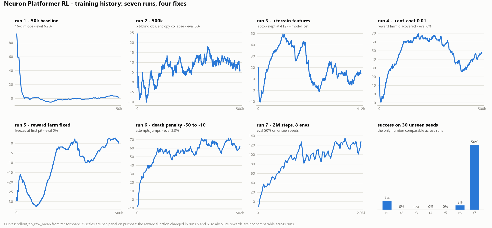
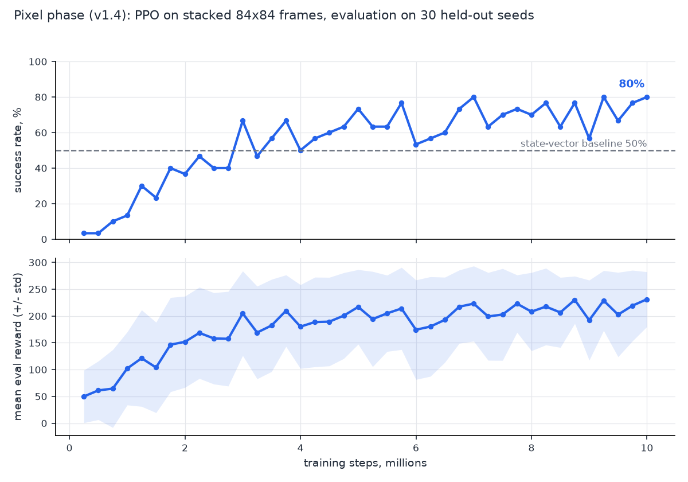
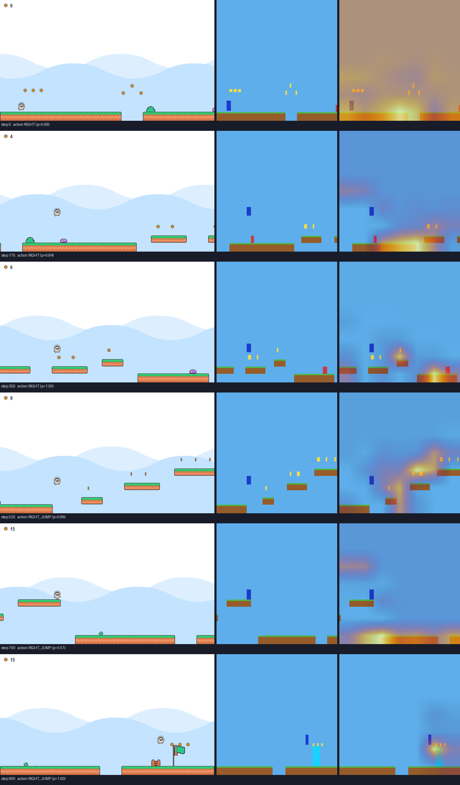
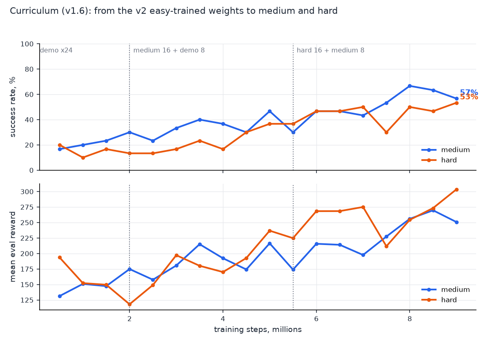

# Neuron Platformer RL

A procedurally generated 2D platformer environment for Reinforcement Learning and Computer Vision experiments.


The agent above plays a level it never saw during training. The panel shows,
in real time, the 19 input features, the actor's hidden activations, the
action distribution and the value estimate behind every decision.

## Project Goals

- Build a custom Gymnasium-compatible platformer environment.
- Train RL agents on procedurally generated levels.
- Avoid memorization by using random seeds and controlled difficulty.
- Compare human play vs AI play.
- Add visual debug overlays for portfolio demonstrations.
- Later: train agents directly from RGB pixels and add object-detection style visualization.

## Features

- Pygame platformer engine
- Gymnasium API: `reset()`, `step()`, `render()`
- Procedural, provably solvable level generator: every gap is capped by the
  jump physics envelope, and `scripts/audit_solvability.py` re-checks the
  guarantee across hundreds of seeds
- Mario-style level patterns: ground runs with pits, floating platform
  sections, bonus ledges, coin arcs, patrolling enemies, decorations
- Difficulty modes: easy, medium, hard, demo
- Fixed demo seed for public presentation
- PPO training with Stable-Baselines3
- State-vector observation for fast first training
- Pixel observation mode: the CNN agent trains on stacked clean 84x84
  frames and beats the state-vector baseline (80% vs 50% on unseen seeds)
- Dual renderer: Kenney sprite art for humans and replays, a clean
  flat-colour frame drawn directly at 84x84 for the agent (the direct
  low-res draw took the env from 129 to ~4,800 steps/s)
- Grad-CAM saliency maps showing where the CNN looks before each action
- Debug overlay with enemies, portal, reward, seed, and metrics
- Live policy monitor: input features, hidden activations, action
  probabilities and V(s) rendered beside the game (roadmap v1.5)
- Functional test suite: `scripts/smoke_test.py` (18 checks, no
  dependencies) and the same checks as pytest cases in `tests/`

## Install

```bash
pip install -r requirements.txt
```

## Human Play

```bash
python human_play.py --difficulty demo --seed 42 --debug
```

Controls:

- Left / A
- Right / D
- Space / Up / W for jump

## Test Environment

```bash
python test_env.py
```

Functional checks (physics, reward contract, enemies, both observation
modes), headless:

```bash
python -m pytest
```

## Audit Level Solvability

```bash
python scripts/audit_solvability.py
```

Simulates the hardest possible jump for every main-path platform transition
across 300 seeds per difficulty and fails if any level is impossible.

## Random Agent

```bash
python -m neuron_platformer_rl.agents.random_agent
```

## Train PPO

```bash
python -m neuron_platformer_rl.agents.train_ppo
```

The model is saved to:

```text
models/ppo_neuron_platformer_v1_state.zip
```

## Watch Trained Agent

```bash
python -m neuron_platformer_rl.agents.play_agent
```

## Evaluate on Unseen Seeds

```bash
python -m neuron_platformer_rl.evaluation.evaluate_agent
```

Defaults evaluate the v1 state model. For the pixel model:

```bash
python -m neuron_platformer_rl.evaluation.evaluate_agent --model models/ppo_neuron_platformer_v2_pixels.zip --obs rgb
```

## Record a Demo GIF

```bash
python scripts/record_agent_gif.py --seed 10000
```

Runs the trained model on the given seed and writes
`assets/demo_agent_brain.gif` with the policy monitor panel attached.

## Training Results (v1 state model)

PPO (SB3), 2M steps across 8 parallel envs, CPU, about 30 minutes.
Evaluated on 30 procedurally generated levels the agent never saw:

| Metric | Value |
|--------|-------|
| Success rate (reached the flag) | 50% |
| Average distance | 2434 px |
| Average coins | 9.7 |

Getting here required fixing four classic RL failure modes, all documented
in code comments: pit-blind observations (terrain features added to the
state vector), entropy collapse (ent_coef), a reward farm from paying for
raw rightward movement (progress is now rewarded only beyond max_x), and
an over-harsh death penalty that taught the agent to freeze at the first
pit edge instead of jumping.

The whole build history, one panel per training run:



Y-scales are per-panel on purpose: the reward function changed between
runs, so episode rewards are not comparable across panels. The only number
that is comparable is the success rate on the same 30 unseen seeds. The
interactive version of every curve is in tensorboard:

```bash
tensorboard --logdir logs/tensorboard
```

## Training Results (v2 pixel model, roadmap v1.4)

The computer-vision phase: no hand-crafted features, the agent reads the
game from pixels alone. PPO with a Nature-CNN policy on 4 stacked clean
84x84 RGB frames (colour kept on purpose: entity classes are
colour-coded), 10M steps across 24 parallel envs, RTX 3070 laptop GPU,
about 3.5 hours:

```bash
python -m neuron_platformer_rl.agents.train_ppo_pixels
```

Every 250k steps the policy was evaluated on the same 30 held-out seeds
as v1; the committed `models/ppo_neuron_platformer_v2_pixels.zip` is the
best-on-eval snapshot, and its numbers reproduce exactly with the
evaluation command above:

| Metric (30 unseen seeds, deterministic) | v1 state | v2 pixels |
|--------|-------|--------|
| Success rate (reached the flag) | 50% | **80%** |
| Average distance | 2434 px | 2943 px |
| Average coins | 9.7 | 15.1 |



The pixel agent crosses the state-vector baseline around 3M steps and
keeps climbing. Rewards in this figure are comparable to each other (one
reward function throughout the run) but not to the v1 panels above.

Two things made this run cheap. The observation renderer draws the flat
frame directly at 84x84 instead of downscaling a full 960x540 frame
(129 to ~4,800 env steps/s). And with an env step at ~0.2 ms, Windows
subprocess vec-envs lost to a plain `DummyVecEnv`: pipe round trips cost
more than the envs themselves (measured ~350 fps subproc x8 vs ~1,000
fps dummy x24 end to end).

## Where the CNN Looks (Grad-CAM)

```bash
python scripts/saliency_maps.py --model models/ppo_neuron_platformer_v2_pixels.zip --seed 10003
```

Gradients of the chosen action's logit weight the last conv layer's
activations into an attention heatmap - the same technique as Grad-CAM
on an image classifier, applied to a policy network:



Columns: human-facing game frame, the actual 84x84 observation, and the
Grad-CAM overlay. The trained network attends to exactly the
task-relevant pixels: the platform edge and the gap ahead of a jump, the
enemy when close, and the portal with its coin cluster in the final
approach.

## Training Results (v3 curriculum, roadmap v1.6)

Continuing from the v2 weights, a difficulty curriculum walks demo ->
medium -> hard with mixed env pools (16 envs on the new tier + 8 on the
previous one), so earlier tiers keep being rehearsed while a harder one
is learned:

```bash
python -m neuron_platformer_rl.agents.train_ppo_curriculum
```

9M steps, ~2.5 h on the same setup. Wider levels get bigger step budgets
(easy/demo 1400, medium 2000, hard 2400): a hard level is up to 5440 px
wide, and with run speed truncating to 4 px/step the flat 1400 budget
could not even cross one.

| Success rate (30 held-out seeds each) | v2 pixels | v3 curriculum |
|---|---|---|
| easy | 80% | 77% |
| demo | 80% | **93%** |
| medium | 33% | **57%** |
| hard | 23% | **53%** |



The committed `models/ppo_neuron_platformer_v3_curriculum.zip` is the
run's final model and also its best-on-eval hard snapshot; the table
reproduces via `evaluate_agent --obs rgb --difficulty <tier>`. Easy
slips by a single episode while every other tier climbs - the mixed
pools kept old skills alive while new ones were learned.

The pixel agent clearing a hard level it never saw, with its actual
84x84 input and a live Grad-CAM beside the game:


```bash
python scripts/record_pixel_agent_gif.py --difficulty hard --seed 10000
```

## Assets

Sprites are from the Kenney "New Platformer Pack" (https://kenney.nl), CC0
licensed. Only the sprites the game uses are vendored in `assets/kenney/`
together with the pack's `License.txt`.

## Roadmap

- v1.1: better metrics and CSV logging
- v1.2: replay saving
- v1.3: human vs AI comparison mode
- v1.4: RGB CNN PPO training - done (80% on unseen seeds + Grad-CAM)
- v1.5: vision debug panel and detection-style overlays - done (policy monitor)
- v1.6: curriculum to medium/hard - done (57% medium / 53% hard from raw pixels)
- v2.0: portfolio dashboard
